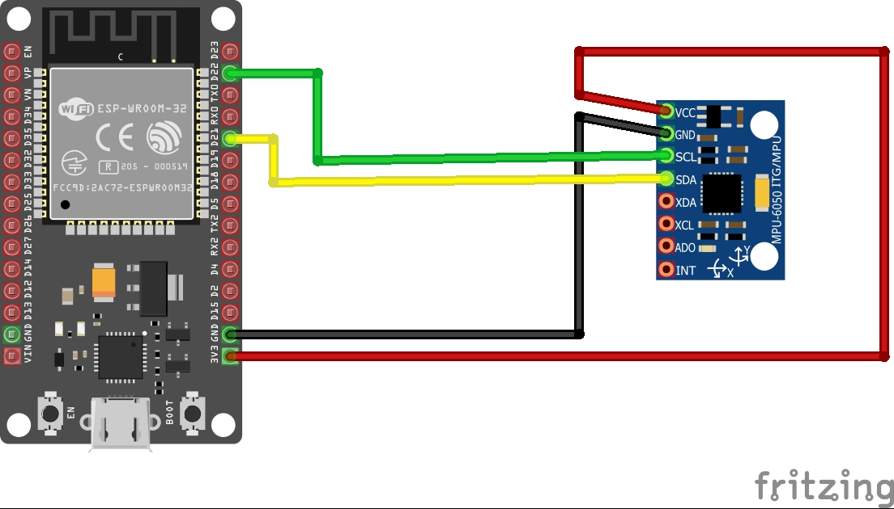
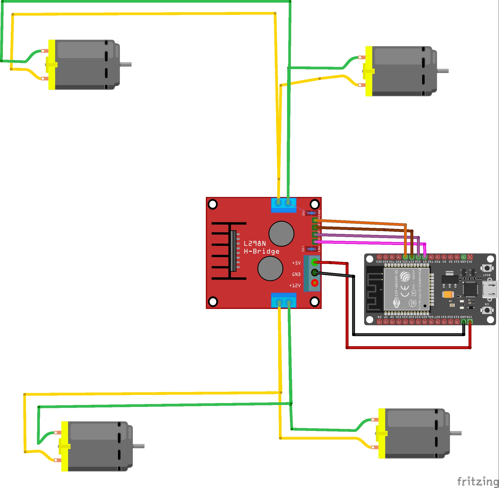

# Gesture Controlled Car using ESP32 

This project demonstrates how to control a car using hand gestures. 
It utilizes an ESP32 microcontroller and an accelerometer (e.g., MPU6050) to detect hand gestures,
which are then translated into movement commands for a car (forward, backward, left, right).

The goal of this project is to create a simple yet effective gesture control system for a robot car using an ESP32 and an accelerometer.
By detecting the orientation of the hand (tilting and positioning), we control the movement of the car (forward, backward, left, right).
This is a fun project that combines gesture recognition, robotics, and wireless control.

## Components
ESP32 Development Board: The brain of the system, responsible for processing sensor data and controlling the motor driver.
MPU6050 Accelerometer/Gyroscope Module: Detects the orientation and tilt of the hand.
L298N Motor Driver: Controls the motors of the car based on ESP32 signals.
DC Motors (x2): Used to drive the car.
Car Chassis: Base platform for the robot car.
Battery: Powers the ESP32 and motor driver.
Jumper Wires: For connections between components.

## Wiring Diagram

## MPU6050 (Accelerometer):

- VCC → 3V3 on ESP32
- GND → GND on ESP32
- SDA → GPIO 21 on ESP32
- SCL → GPIO 22 on ESP32

## L298N Motor Driver:

- IN1 → GPIO 32 (Control for Motor 1)
- IN2 → GPIO 33 (Control for Motor 1)
- IN3 → GPIO 25 (Control for Motor 2)
- IN4 → GPIO 26 (Control for Motor 2)
- ENA → 5V
- ENB → 5V
- VCC → 5V Battery
- GND → GND
- DC Motors: Connect to the motor driver outputs

## Libraries Used
- Wire: I2C communication for connecting ESP32 with the MPU6050.
- MPU6050: Library to interface with the accelerometer.
- ESP32 Servo: If you wish to add servos for extra control.
